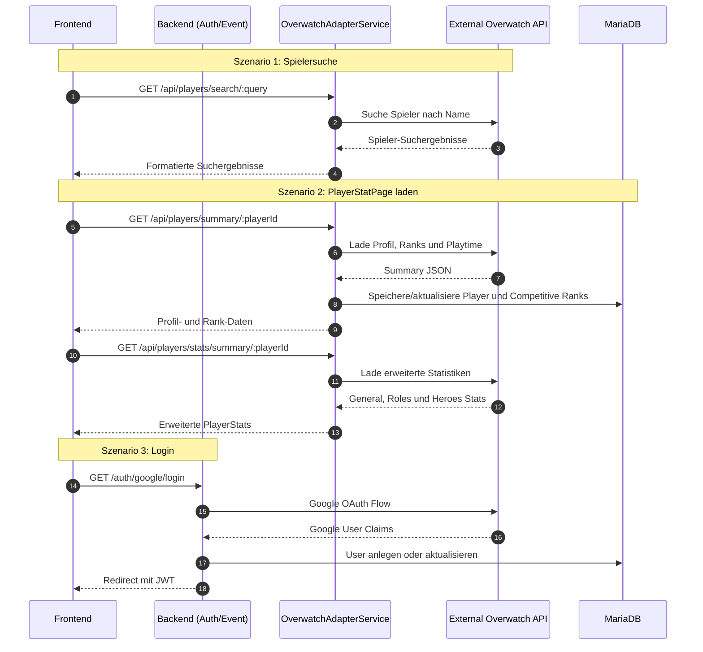

# Overwatch Tracker

Overwatch Tracker ist eine Webanwendung zum Suchen und Anzeigen von Overwatch-Spielerprofilen. Das Frontend bietet eine Player Search und eine PlayerStatPage, auf der Profilinformationen, Ranks, Hero-Playtime und erweiterte Statistiken wie Winrate, KDA, Damage, Healing und Hero-spezifische Durchschnittswerte angezeigt werden.

Das Projekt besteht aus drei Teilen:

- React/Vite Frontend fuer Suche, Login, Dashboard und PlayerStats
- OverwatchAdapterService als Express API zwischen Frontend, Datenbank und externer Overwatch API
- ASP.NET Core Backend fuer Google Login, JWT und geschuetzte App-Bereiche

## Features

- Overwatch-Spieler nach Namen suchen
- Spielerprofil mit Avatar, Namecard, Titel und Endorsement anzeigen
- Competitive Ranks fuer Tank, Damage und Support darstellen
- Hero-Playtime anzeigen
- Erweiterte PlayerStats ueber `/api/players/stats/summary/:playerId`
- General Stats mit Games, Wins, Losses, Winrate, KDA und Time Played
- Total- und Average-Werte fuer Eliminations, Assists, Deaths, Damage und Healing
- Rollen-Stats fuer Tank, Damage und Support
- Hero-Stats-Tabelle mit Games, W/L, Winrate, KDA, Time, Avg Elims, Avg Damage und Avg Healing
- Google OAuth Login mit JWT fuer geschuetzte Seiten
- MariaDB mit phpMyAdmin fuer lokale Entwicklung

## Technologie-Stack

| Bereich | Technologie |
|---|---|
| Frontend | React, Vite, React Router, CSS, lucide-react |
| Overwatch Adapter | Node.js, Express, MariaDB Client |
| Backend | ASP.NET Core 8, Entity Framework Core, Google OAuth, JWT |
| Datenbank | MariaDB |
| Tools | Docker Compose, phpMyAdmin |

## Projektstruktur

```text
SportTracker/
├── backend/                 # ASP.NET Core Backend fuer Auth und geschuetzte Bereiche
│   ├── Controllers/
│   ├── Data/
│   ├── Models/
│   └── Program.cs
├── frontend/                # React/Vite Frontend
│   ├── src/
│   │   ├── components/
│   │   ├── pages/
│   │   └── tools/
│   └── vite.config.js
├── overwatchAdapter/        # Express Service fuer Overwatch-Spielerdaten
│   ├── src/controller/
│   ├── app.js
│   └── db.js
├── doc/                     # SQL-Dateien und Diagramme
├── docker-compose.yaml      # MariaDB + phpMyAdmin
├── mermaid.md               # Sequence Diagramm
└── README.md
```

## Architektur

Das Frontend spricht fuer Overwatch-Daten nicht direkt mit der externen API. Stattdessen leitet Vite alle Requests unter `/api` an den OverwatchAdapterService auf `localhost:8081` weiter. Der Adapter ruft die externe Overwatch API ab, formatiert die Daten fuer das Frontend und speichert relevante Profil- und Rank-Daten in MariaDB.

Das ASP.NET Core Backend ist getrennt davon fuer Authentifizierung zustaendig. Der Google Login erzeugt nach erfolgreicher Anmeldung einen JWT, den das Frontend fuer geschuetzte Seiten verwenden kann.

## Sequence Diagramm



## API-Uebersicht

### OverwatchAdapterService

Base URL in der lokalen Entwicklung: `http://localhost:8081`

| Methode | Route | Beschreibung |
|---|---|---|
| GET | `/api/players/search/:query` | Sucht Overwatch-Spieler nach Namen |
| GET | `/api/players/summary/:playerId` | Laedt Profil, Namecard, Avatar, Endorsement, Competitive Ranks und Playtime |
| GET | `/api/players/stats/summary/:playerId` | Laedt erweiterte Statistiken fuer General, Roles und Heroes |

### ASP.NET Core Backend

Base URL in der lokalen Entwicklung: `http://localhost:5000`

| Methode | Route | Beschreibung |
|---|---|---|
| GET | `/auth/google/login` | Startet den Google OAuth Login |
| GET | `/auth/google/finalize` | Finalisiert den OAuth Flow und erzeugt den JWT |
| GET | `/auth/logout` | Meldet den Benutzer ab |

## Lokales Setup

### Voraussetzungen

- Node.js
- npm
- .NET 8 SDK
- Docker und Docker Compose

### 1. Datenbank starten

```bash
docker compose up -d
```

MariaDB laeuft danach lokal auf Port `3306`.
phpMyAdmin ist unter `http://localhost:8337` erreichbar.

### 2. OverwatchAdapter konfigurieren

Lege in `overwatchAdapter/` eine `.env` Datei an. Als Vorlage kann `.env.example` verwendet werden.

```env
DB_HOST=localhost
DB_PORT=3306
DB_USER=admin
DB_PASSWORD=cisco
DB_NAME=gameService
```

Dann Dependencies installieren und Service starten:

```bash
cd overwatchAdapter
npm install
node app.js
```

Der Adapter laeuft auf `http://localhost:8081`.

### 3. Backend konfigurieren

In `backend/appsettings.Development.json` muessen fuer den Google Login die OAuth- und JWT-Werte gesetzt werden:

```json
{
  "Authentication": {
    "Google": {
      "ClientId": "GOOGLE_CLIENT_ID",
      "ClientSecret": "GOOGLE_CLIENT_SECRET"
    },
    "Jwt": {
      "Key": "MINDESTENS_LANGER_SECRET_KEY",
      "Issuer": "SportTracker",
      "Audience": "SportTrackerUsers"
    }
  }
}
```

Backend starten:

```bash
cd backend
dotnet run
```

Das Backend laeuft standardmaessig auf `http://localhost:5000`.

### 4. Frontend starten

```bash
cd frontend
npm install
npm run dev
```

Das Frontend ist danach unter `http://localhost:5173` erreichbar.

## Wichtige Frontend-Seiten

| Datei | Aufgabe |
|---|---|
| `frontend/src/pages/PlayerSearch.jsx` | Suche nach Overwatch-Spielern |
| `frontend/src/pages/PlayerStatPage.jsx` | Detailseite fuer Profil, Ranks und erweiterte PlayerStats |
| `frontend/src/pages/LoginPage.jsx` | Google Login und JWT-Uebernahme |
| `frontend/src/pages/Dashboard.jsx` | Geschuetzter Bereich nach Login |
| `frontend/src/components/ProtectedRoute.jsx` | Route Guard fuer eingeloggte Benutzer |
| `frontend/src/tools/OverwatchApiHandler.js` | API-Client fuer OverwatchAdapter-Routen |

## PlayerStats

Die PlayerStatPage nutzt zwei Datenquellen:

1. `/api/players/summary/:playerId`
   - Profilname
   - Avatar
   - Namecard
   - Endorsement
   - Competitive Ranks
   - Hero-Playtime

2. `/api/players/stats/summary/:playerId`
   - `general`: Gesamtstatistiken
   - `roles`: Tank, Damage und Support
   - `heroes`: Statistiken pro Hero

Die erweiterten Stats werden getrennt geladen, damit das Profil weiterhin angezeigt werden kann, auch wenn die Statistikdaten spaeter oder gar nicht verfuegbar sind.

## Build

Frontend Build:

```bash
cd frontend
npm run build
```

Backend Build:

```bash
cd backend
dotnet build
```

## Aktueller Stand

- Player Search funktioniert ueber den OverwatchAdapterService
- PlayerStatPage zeigt Profil, Ranks und Hero-Playtime
- Erweiterte PlayerStats sind im Frontend eingebunden
- Google Login und geschuetzte Routen sind vorbereitet
- MariaDB und phpMyAdmin koennen lokal per Docker Compose gestartet werden

## Hinweise

- Secrets wie Google Client Secret oder JWT Key sollten nicht committed werden.
- Die Vite Proxy-Konfiguration leitet `/api` automatisch an `http://localhost:8081` weiter.
- Fuer die PlayerStats muss der OverwatchAdapterService laufen, sonst bleiben Suche und Statistikdaten leer.
