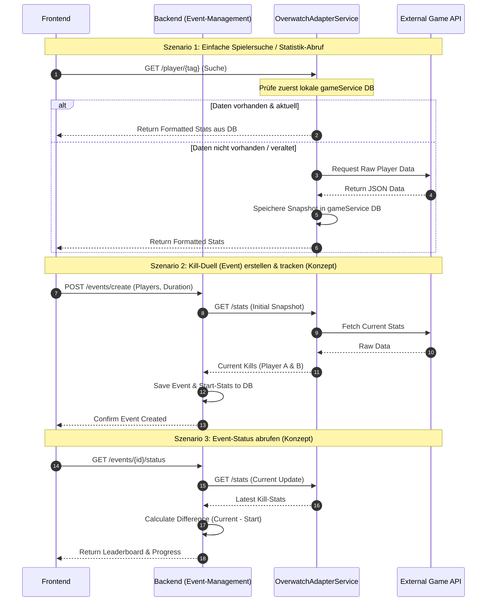

# SportTracker (Overwatch Edition)

Willkommen bei **SportTracker** – einem Projekt, das wir gemeinsam im Rahmen des Fachs **SDM** umgesetzt haben.

Die Idee: Eine Webplattform, die Spielerstatistiken trackt. Der aktuelle Fokus des Projekts liegt auf der Implementierung eines voll funktionsfähigen Trackers für **Overwatch**. Das System wurde modular aufgebaut, um theoretisch später weitere Spiele (wie *League of Legends, Valorant, CS2*) ohne großen Umbau ergänzen zu können.

---

## Was kann die Seite?

Im Kern geht es darum, dass Spieler ihre Performance nachverfolgen können. Dazu gehören Dinge wie Rang, Kills, Deaths, Healing – also alles, was man wissen will.

### Die zwei Kern-Säulen des Projekts:

1. **Der Overwatch-Tracker (Funktionstüchtig):**
   Fragt Daten ab und bereitet diese visuell auf. Um die externe API zu schonen, verfügt das System über einen intelligenten Caching-Mechanismus: Bei einer Anfrage wird zuerst geprüft, ob die Daten bereits in unserer lokalen `gameService`-Datenbank liegen. Wenn ja, werden sie direkt von dort geladen. Wenn nein (oder wenn ein neuer Snapshot erzwungen wird), setzt der Service einen Request an die externe Overfast-API ab und persistiert die Ergebnisse lokal.

2. **Die EventApp (Konzept & Grundstruktur):**
   Ermöglicht es außerhalb des Trackings, einen separaten User-Account zu erstellen, Freunde zu adden und mit diesen gemeinsame Events zu "spielen". Geplant war hier die Funktionalität, um Challenges wie ein *„Killduell über 3 Wochen“* zu starten.
   > **Hinweis zum Projektstatus:** Diese Event-Logik (Berechnung und Verwaltung der Events) haben wir im zeitlichen Rahmen des Projekts leider **nicht mehr vollständig implementiert** bekommen. Die Registrierung, Authentifizierung und die API-Strukturen sind jedoch vorbereitet.

---

## Technologien

Hier ist, womit wir arbeiten:

**Backend (Event-Management & Auth)**
- [ASP.NET Core](https://learn.microsoft.com/aspnet/core) (.NET) – REST API, Routing, Business Logic für User und Events
- **Entity Framework Core** – ORM für die Datenbankanbindung (`eventApp` DB), Migrationen und Modellierung der Entitäten

**OverwatchAdapterService (Microservice)**
- **Node.js / Express** – eigenständiger Microservice für die Overwatch-Anbindung (Port 8081)
- **MariaDB** – speichert Spielerdaten, Competitive Stats und detaillierte Stat-Snapshots (`gameService` DB)
- **Overfast API** – externe API, von der wir die Live-Spielerdaten ziehen

**Frontend**
- **React (Vite)** – komponentenbasiertes, responsives UI
- **HTML / CSS** – Grundstruktur & Styling

---

## Systemarchitektur & Datenfluss

Das folgende Sequenzdiagramm verdeutlicht, wie das Frontend mit dem Backend und dem Overwatch-Adapter kommuniziert – sowohl für die reine Spielersuche als auch für das (geplante) Event-Feature.


## Wichtige Entitäten (Auszug Backend)
Hier ein kurzer Überblick über die zentralen Bausteine unseres Datenmodells im ASP.NET Core Backend.

### `Summoner` (bzw. In-Game-Profil)
Der verknüpfte In-Game-Account des Spielers. Hier hängen der aktuelle **Rank** sowie die **Historie** vergangener Ränge dran.

```csharp
namespace Backend.Models;

public class User
{
    public int UserId { get; set; }
    public string Username { get; set; } = string.Empty;
    public string Email { get; set; } = string.Empty;

    public ICollection<Freundschaft> GesendeteFreundschaften { get; set; } = [];
    public ICollection<Freundschaft> EmpfangeneFreundschaften { get; set; } = [];
    public ICollection<Event> ErstellteEvents { get; set; } = [];
    public ICollection<EventTeilnahme> Teilnahmen { get; set; } = [];

    public User() { }

    public User(int userId, string username, string email)
    {
        this.UserId = userId;
        this.Username = username;
        this.Email = email;
    }
}
```
```csharp
namespace Backend.Models;

public class Event
{
public int EventId { get; set; }

    public int CategoryId { get; set; }
    public EventKategorie Kategorie { get; set; } = null!;

    public int CreatorId { get; set; }
    public User Creator { get; set; } = null!;

    public int TargetValue { get; set; }
    public DateTime StartDate { get; set; }
    public DateTime EndDate { get; set; }

    public ICollection<EventTeilnahme> Teilnahmen { get; set; } = [];

    public Event(int eventId, int categoryId, int creatorId, int targetValue, DateTime startDate, DateTime endDate)
    {
        this.EventId = eventId;
        this.CategoryId = categoryId;
        this.CreatorId = creatorId;
        this.TargetValue = targetValue;
        this.StartDate = startDate;
        this.EndDate = endDate;
    }
}
```

# Installations- und Startanleitung

Befolge diese Schritte, um die gesamte Anwendung lokal aufzusetzen und zu starten.

### 1. OverwatchAdapterService starten
Der OverwatchAdapterService kümmert sich um die MariaDB-Anbindung der Spielerdaten und die Overfast-API.

1. Navigiere in das Verzeichnis:
   ```bash
   cd overwatchAdapter
   ```
2. Erstelle eine `.env`-Datei im Root dieses Ordners basierend auf der `.env.example` und trage deine MariaDB-Zugangsdaten ein.
3. Abhängigkeiten installieren:
   ```bash
   npm install
   ```
4. Service starten:
   ```bash
   node app.js
   ```
   *Der Service läuft nun standardmäßig auf Port 8081.*

### 2. Backend starten (Event App & Auth)
Das ASP.NET Core Backend verwaltet die User-Daten und die (geplante) Event-Logik.

1. Navigiere in das Verzeichnis:
   ```bash
   cd backend
   ```
2. Stelle sicher, dass die `appsettings.Development.json` (oder `appsettings.json`) mit den korrekten Verbindungsdaten für die `eventApp`-Datenbank sowie den Google-OAuth-Secrets befüllt ist.
3. Anwendung starten:
   ```bash
   dotnet run
   ```

### 3. Frontend starten (React)
Das Frontend verbindet beide Services in einer UI.

1. Navigiere in das Verzeichnis:
   ```bash
   cd frontend
   ```
2. Abhängigkeiten installieren:
   ```bash
   npm install
   ```
3. Development-Server starten:
   ```bash
   npm run dev
   ```
4. Öffne den im Terminal angezeigten Localhost-Link (meistens `http://localhost:5173`) in deinem Browser.

---