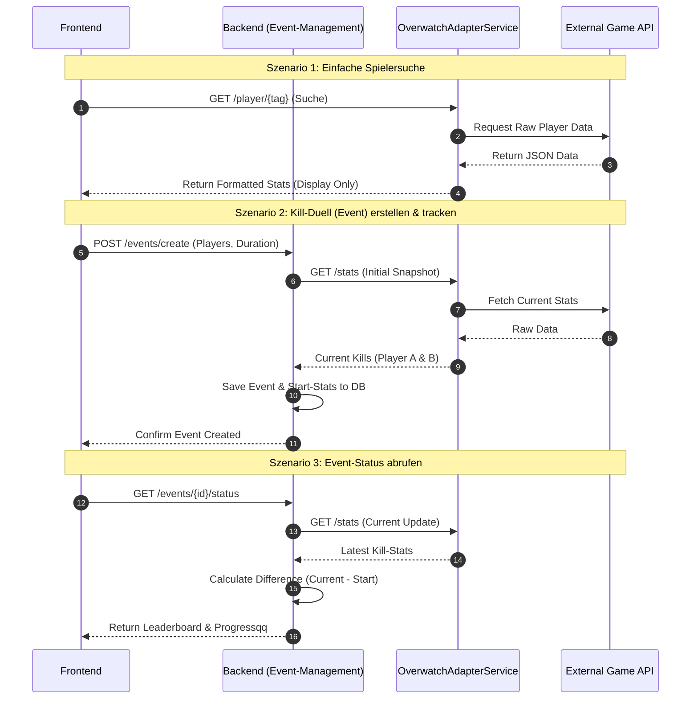

```mermaid
sequenceDiagram
    autonumber
    participant FE as Frontend
    participant BE as Backend (Event-Management)
    participant OA as OverwatchAdapterService
    participant API as External Game API

    Note over FE, API: Szenario 1: Einfache Spielersuche
    FE->>OA: GET /player/{tag} (Suche)
    OA->>API: Request Raw Player Data
    API-->>OA: Return JSON Data
    OA-->>FE: Return Formatted Stats (Display Only)

    Note over FE, API: Szenario 2: Kill-Duell (Event) erstellen & tracken
    FE->>BE: POST /events/create (Players, Duration)
    BE->>OA: GET /stats (Initial Snapshot)
    OA->>API: Fetch Current Stats
    API-->>OA: Raw Data
    OA-->>BE: Current Kills (Player A & B)
    BE->>BE: Save Event & Start-Stats to DB
    BE-->>FE: Confirm Event Created

    Note over FE, API: Szenario 3: Event-Status abrufen
    FE->>BE: GET /events/{id}/status
    BE->>OA: GET /stats (Current Update)
    OA-->>BE: Latest Kill-Stats
    BE->>BE: Calculate Difference (Current - Start)
    BE-->>FE: Return Leaderboard & Progressqq
```
